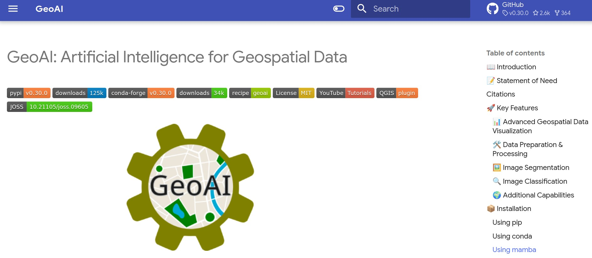
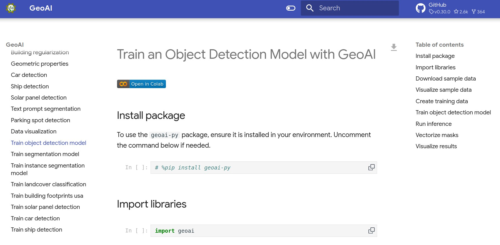
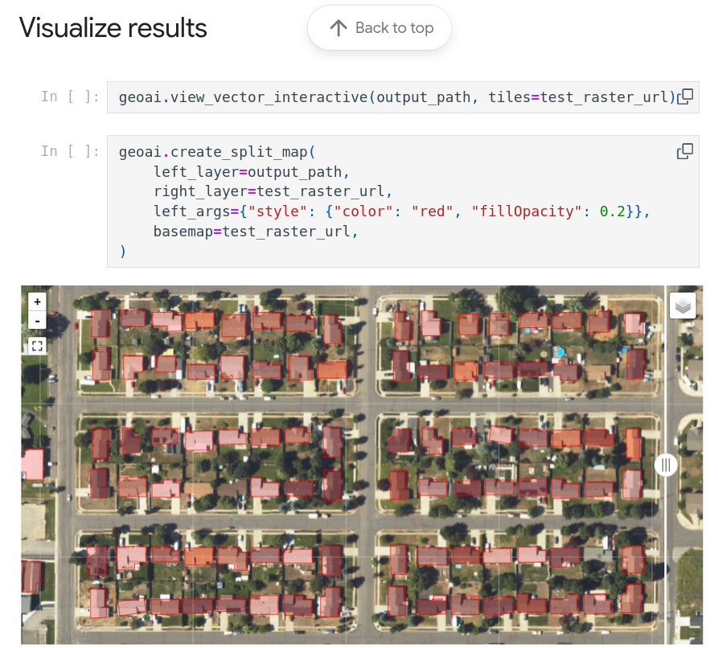

class: center, middle, inverse


```{r setup, include=FALSE}
options(htmltools.dir.version = FALSE)
knitr::opts_chunk$set(
  fig.width = 12, 
  fig.height = 8, 
  fig.retina = 3,
  out.width = "100%",
  cache = FALSE,
  echo = FALSE,
  message = FALSE, 
  warning = FALSE,
  hiline = TRUE
)
```

```{css, echo=FALSE, eval=T}
.title-slide {
  background-image: url('img/fondo.jpg');
  background-size: cover;
  background-position: center;
}

<!-- .title-slide .remark-slide-content { -->
<!--   background: rgba(0, 0, 0, 0.7); -->
<!--   color: white; -->
<!-- } -->

.remark-slide-content.title-slide {
  position: relative;
  color: white !important;
}

.remark-slide-content.title-slide::before {
  content: "";
  position: absolute;
  inset: 0;
  background: rgba(0,0,0,0.35);
  z-index: 0;
}

.remark-slide-content.title-slide > * {
  position: relative;
  z-index: 1;
}

.remark-slide-content {
  font-size: 26px;
}

.remark-slide-content ul li {
  margin-bottom: 12px;
}

.large { font-size: 130% }
.medium { font-size: 110% }
.small { font-size: 90% }
.tiny { font-size: 70% }
.green { color: #2E8B57; }
.blue { color: #4169E1; }
.red { color: #DC143C; }
.highlight {
  background-color: #ffff99;
  padding: 2px 4px;
}

.box {
  background-color: #f0f8ff;
  border: 2px solid #4169E1;
  border-radius: 10px;
  padding: 20px;
  margin: 10px 0;
}

.box.light {
  background-color: #eef4fb;
  border-left: 6px solid #4169E1;
  border-radius: 10px;
  padding: 18px 22px;
  margin: 15px 0;
  display: flex;
  align-items: flex-start;
  gap: 14px;
  font-size: 1em;
  line-height: 1.4;
}

/* Icono */
.box.light::before {
  content: "💡";
  font-size: 1.6em;
  flex-shrink: 0;
}

/* Texto */
.box.light p {
  margin: 0;
}

.remark-slide-content .MathJax {
  font-size: 150% !important;
}

.equation {
  background-color: #f5f5f5;
  border-left: 5px solid #2E8B57;
  padding: 15px;
  margin: 10px 0;
  font-family: 'Courier New', monospace;
}
```


```{css, echo=F, eval=F}
.medium { font-size: 110% }
.small { font-size: 90% }
.tiny { font-size: 70% }
.green { color: #2E8B57; }
.blue { color: #4169E1; }
.red { color: #DC143C; }
.highlight { background-color: #ffff99; padding: 2px 4px; }
.box { background-color: #f0f8ff; border: 2px solid #4169E1; border-radius: 10px; padding: 20px; margin: 10px 0; }
.equation { background-color: #f5f5f5; border-left: 5px solid #2E8B57; padding: 15px; margin: 10px 0; font-family: 'Courier New', monospace; }
```

```{r, out.width='50%'}

```


---
class: center, middle, inverse

# 🧠 GEOAI

## Inteligencia Artificial aplicada a la Información Geoespacial

---

# Estructura temporal (3 horas)

- **Bloque 1 (40 min)** — Fundamentos técnicos de GeoAI

- **Bloque 2 (50 min)** — Modelos fundacionales y embeddings

- **Bloque 3 (50 min)** — Integración con pipelines reales (casos propios)

- **Bloque 4 (40 min)** — Ecosistema práctico (Python, o QGIS + Python)

- **Discusión (20 min)** — Limitaciones, ética y futuro

---
class: center, middle, inverse

# BLOQUE 1

---

## Objetivo del módulo

* Comprender qué es **GeoAI**.
* Reconocer herramientas actuales (Python, o Python + QGIS).
* Visualizar aplicaciones reales en geociencias.
* Conectar con trabajos previos (Embeddings satelitales + Fotogrametría).

---

# ¿Por qué GeoAI ahora?

* Explosión de datos satelitales (Sentinel, Landsat, Planet, etc.).
* Ortofotos de ultra alta resolución.
* Sensores GNSS, LiDAR, drones.
* Modelos fundacionales (foundation models).

.box.light[
  La resolución espacial/temporal/radiométrica/espectral del dato supera la capacidad de análisis manual.
]

---

# ¿Qué es GeoAI?

**GeoAI = Inteligencia Artificial + Datos Geoespaciales + Métodos Espaciales**

Integra:

* Machine Learning/deep Learning
* Computer Vision
* Modelos espacio‑temporales
* Computación en la nube (e.g. GEE)

Aplicado a:

* Clasificación
* Segmentación
* Detección de objetos
* Predicción espacial

---

# IA vs ML vs Deep Learning

| Concepto | Idea clave                        |
| -------- | --------------------------------- |
| IA       | Sistemas que simulan inteligencia |
| ML       | Aprenden patrones desde datos     |
| DL       | Redes neuronales profundas        |

En GeoAI predominan:

* **CNN**: Redes para analizar imágenes (clasificación, segmentación).
* **Transformers**: Modelos de atención para capturar relaciones complejas (contexto).
* **Vision-Language**: Integran imágenes y texto.

---

# GeoAI en geociencias

* Uso del suelo
* Cambio de cobertura
* Detección de edificaciones
* Modelado de distribución de especies
* Segmentación automática de hábitat

---

# Implementación

- Existen paquetes y "tuberías" (*pipelines*) personalizadas.

- Integración con plataformas geoespaciales (QGIS, Google Earth Engine, Python/R).

- Uso de modelos pre-entrenados y *fine-tuning* con datos locales.

- GeoAI es un paquete en Python que integra IA y análisis geoespacial, permitiendo aplicar modelos avanzados de *deep learning* (PyTorch, Transformers, etc.) a imágenes satelitales, fotografías aéreas y datos vectoriales con mínima programación.

---
class: figure-slide, center, inverse, middle

```{r, out.width='120%', echo=F, eval=T}

```

https://opengeoai.org/

---
class: figure-slide, center, inverse, middle

```{r, out.width='120%', echo=F, eval=T}

```

https://opengeoai.org/examples/train_object_detection_model/

---
class: figure-slide, center, inverse, middle

```{r, out.width='80%', echo=F, eval=T}

```

https://opengeoai.org/examples/train_object_detection_model/

---
class: center, middle, inverse

# Fundamentos técnicos

---

# ¿Qué distingue GeoAI del ML clásico?

GeoAI no es solo ML aplicado a mapas.

Integra:

* Dependencia espacial
* Autocorrelación
* Estructura jerárquica
* Escalas múltiples
* No‑estacionariedad

Pregunta clave:

> ¿Cómo incorporar estructura espacial en modelos de IA?

---

# Autocorrelación espacial

Primera Ley de Tobler:

> "Todo está relacionado con todo lo demás, pero las cosas cercanas están más relacionadas."

En ML tradicional:

$$
X_i \perp X_j
$$

<small><em>Supuesto de independencia estadística entre observaciones; no se modela estructura espacial.</em></small>

En GeoAI:

$$\operatorname{Cov}(X_i, X_j) = f(d_{ij})$$
---

## Diferencias

- La **covarianza depende de la distancia espacial** entre observaciones; existe autocorrelación espacial explícita.
- Covarianza cero ⇒ no correlación lineal
- Independencia ⇒ no dependencia de ningún tipo

## Implicación

* Validación cruzada espacial obligatoria.

---

# Problema crítico: Data Leakage espacial

En datos geoespaciales:

$$\operatorname{Cov}(X_i, X_j) \neq 0 \quad \text{si} \quad d_{ij} \text{ es pequeño}$$

Observaciones cercanas son similares.

---

## ¿Qué ocurre si dividimos aleatoriamente?

* Puntos de entrenamiento y prueba pueden estar muy próximos.
* El modelo aprende patrones locales.
* Evalúa sobre datos casi “ya vistos”.

📈 Métricas infladas  
📉 Generalización real pobre  

## Soluciones

* **Spatial block cross-validation**  
  → dividir el espacio en bloques independientes

* **Leave-one-region-out**  
  → entrenar en regiones A–C, probar en región D

---

# Tipos de tareas GeoAI

1. **Clasificación pixel-based**
2. **Segmentación semántica**
3. **Detección de objetos**
4. **Modelos espacio-temporales**
5. **Embeddings geoespaciales**

---

class: center, middle

# BLOQUE 2

# Modelos fundacionales y embeddings

---

## ¿Qué es un embedding satelital?

Una imagen satelital es un tensor:

$$
I \in \mathbb{R}^{H \times W \times B}
$$

Un modelo profundo transforma esa imagen en:

$$
z = f_\theta(I), \quad z \in \mathbb{R}^d
$$

donde:

* ($d \ll H \times W \times B$). La dimensión del embedding es mucho menor que la dimensión original. Ejemplo: Original: 655,360 dimensiones. Embedding: 256 dimensiones
* ($z$) es una **representación latente compacta**

---

### En términos prácticos

* Comprime información espectral y espacial.
* Reduce cientos de miles de valores a un vector pequeño.
* Imágenes similares → vectores cercanos en $\mathbb{R}^d$.
* Permite clustering, clasificación y modelado ecológico.
* Captura patrones espectrales, espaciales y contextuales.

---

# Foundation Models en teledetección

Características:

* Pre-entrenados con millones de imágenes.
* Aprenden representación general.
* Permiten fine-tuning ligero.

Ejemplos conceptuales:

* Modelos tipo Vision Transformer
* Modelos multimodales (imagen + texto)

---

# Pipeline real — AlphaEarth Foundations

<!-- (Insertar esquema original) -->

Pipeline implementado por usted:

1. Descarga de tiles
2. Extracción de embeddings
3. Reducción
   - UMAP. *Uniform Manifold Approximation and Projection*. Es un algoritmo de reducción de dimensionalidad no lineal.
   - PCA. Tradicional
4. Clustering
5. Clasificación supervisada
6. Evaluación

---

# 🧩 Diferencia PCA vs. UMAP

| PCA                      | UMAP                        |
| ------------------------ | --------------------------- |
| Lineal                   | No lineal                   |
| Preserva varianza global | Preserva estructura local   |
| Rápido y estable         | Más flexible, más expresivo |


---

# Matemática simplificada del embedding

Si $f_\theta$ es el modelo:

$$z = f_\theta(I)$$

Luego:

$$\hat{y} = g(z)$$

Separación entre:

* Representación
* Clasificador final

---
class: center, middle, inverse

# APLICACIONES

(demos al final)

---


# Aplicación 1 — Clasificación de coberturas y uso del suelo

## Flujo con machine learning

Sentinel → Embeddings → Random Forest → Mapa final

## Discusión

* Ventajas frente a índices espectrales clásicos.
* Robustez ante ruido.

---

# Aplicación 2 — Diseño de muestreo

Idea clave:

Clusterizar espacio latente para:

* Detectar heterogeneidad ambiental.
* Optimizar ubicación de puntos.

Conexión directa con análisis espacial clásico.

---

# Aplicación 3 — Modelado de distribución de especies

Embeddings como predictores en:

* GLM
* Random Forest
* Boosting

Comparación con:

* WorldClim
* Variables topográficas clásicas

---
class: center, middle

# BLOQUE 3

# Integración con pipelines propios

---

# Pipeline integrado multiescala

Satélite (10 m)
→ Embeddings
→ Clasificación regional
→ Selección de sitios
→ Drone
→ Fotogrametría terrestre
→ Segmentación micro‑hábitat

---

# Fotogrametría terrestre + IA

Posibilidades:

* Segmentación automática de individuos
* Clasificación de micro-estructuras
* Métricas estructurales automatizadas

---

# Integración con R y análisis estadístico

Después de segmentación:

* Exportar shapefiles
* Calcular métricas en R
* Modelos mixtos
* Análisis espacial clásico

GeoAI como generador de variables.

---

# Evaluación rigurosa

Métricas:

* Accuracy
* F1-score
* IoU (segmentación)
* AUC

Pero también:

* Validación espacial
* Transferibilidad
* Robustez entre regiones

---

class: center, middle

# BLOQUE 4

# Ecosistema práctico

---

# GeoAI Python

Arquitectura típica:

* Rasterio
* Torch
* Transformers
* SamGeo

Ejemplo conceptual:

```{python, eval=F, echo=T}
from segment_anything import SamPredictor
```

---

# QGIS como interfaz experimental

Plugins:

- [GeoAI (Qiusheng Wu)](https://plugins.qgis.org/plugins/geoai/)
- [Geo Knowledge AI](https://plugins.qgis.org/plugins/geo_knowledge_ai/#plugin-about)

Ventajas para curso:

* Visual, la interfaz gráfica facilita la adopción.
* Sin necesidad de programar mucho, **aunque requiere configuración previa y acceso a servicios de computación en la nube o modelos en línea**.

---

# Demos

- Primero, hablemos de [OSGeoLive](https://live.osgeo.org/en/index.html)

- Veamos un cuaderno de GeoAI. [Train an Object Detection Model with GeoAI](https://colab.research.google.com/drive/1GtUjHEYBIu6YwyY3aEohkoz_DylnkvtK?usp=sharing)

---

# Aplicaciones en RD

- Nubes de puntos clasificadas, CloudCompare.

- [Aplicaciones de los embeddings satelitales de Google AlphaEarth Foundations en el análisis geoespacial: clasificación de uso del suelo, modelado de distribución de especies y diseño de muestreo](https://geofis.github.io/ciidi-uasd-2025-aef-embeddings/presentacion.html)
- [Estadística zonal multipropósito sobre información geoespacial de República Dominicana, usando Google Earth Engine, Python y R](https://geofis.github.io/estadistica-zonal-multiproposito-rd/presentaciones/II-Congreso-IDI-XXII-JIC-nov23.html#/)

---

# Aplicaciones en RD (cont.)

- [Fotogrametría terrestre de ultra alta resolución aplicada a la evaluación de hábitat y diversidad biológica en microescala](https://geofis.github.io/ciidi-uasd-2025-fotogrametria-terrestre-aplicada/presentacion.html)
- [Cartografía geomorfológica de detalle de un río tropical usando fotografías aéreas de resolución centimétrica y *deep learning*](https://geofis.github.io/geomorfologia-detalle-tramo-1km-rio-mana/)

---

# Limitaciones actuales

* Dependencia de GPU
* Sesgo en datos de entrenamiento
* Generalización limitada
* Interpretabilidad

---

class: center, middle

# Discusión avanzada

---

# Ética y soberanía tecnológica

* Dependencia de modelos externos.
* Reproducibilidad.
* Transparencia.
* Acceso desigual a cómputo.

---

# Futuro de GeoAI

* Modelos multimodales geoespaciales.
* Integración GNSS + visión.
* Modelos 4D espacio-temporales.
* Edge AI en drones y sensores.

---

# Conclusión técnica

GeoAI no reemplaza:

* Estadística espacial
* Fundamentos geomáticos
* Teoría ecológica

---

# Ruta de aprendizaje

1. QGIS + Plugins AI (e.g. GeoAI).
2. Python básico.
3. Modelos pre‑entrenados.
4. Ajuste fino (fine‑tuning).

.box.light[
GeoAI no reemplaza fundamentos. Los amplifica.
]

---

# 🏁 Cierre

✔ Comprendimos qué es GeoAI.

✔ Exploramos herramientas.

✔ Vimos aplicaciones reales.

✔ Listos para experimentar en una formación avanzada.

---

# Preguntas para orientar aplicaciones específicas

* ¿Cómo validarías un modelo GeoAI en ecosistemas tropicales?
* ¿Qué variables latentes podrían sustituir variables clásicas?
* ¿Cómo diseñarías un *pipeline* reproducible en su laboratorio?


```{r, echo=F}
knitr::knit_exit()
```


---
title: "Módulo: Introducción a la Inteligencia Artificial Geoespacial"
subtitle: "<small>https://geofis.github.io/intro-herramientas-geoai/presentacion.html</small>"
author: "José Ramón Martínez Batlle"
institute: "Universidad Autónoma de Santo Domingo (UASD)"
date: "Actualizado: `r Sys.Date()`"
output:
  xaringan::moon_reader:
    self_contained: true
    lib_dir: null
    mathjax: "default"
    seal: false
    nature:
      highlightStyle: github
      highlightLines: true
      countIncrementalSlides: false
---

class: center, middle, inverse

# 🧠 GeoAI

## Inteligencia Artificial aplicada a la Información Geoespacial

---

class: center, middle

# 🔹 Conexión con trabajos previos

---

# Embeddings satelitales

*(Insertar aquí figura de la presentación AlphaEarth Foundations)*

* Representaciones numéricas de imágenes.
* Reducción de dimensionalidad.
* Clasificación sin etiquetado intensivo.

Aplicaciones que ya mostramos:

* Clasificación de uso del suelo.
* Diseño de muestreo.
* Modelado ecológico.

---

# Flujo conceptual con embeddings

Imagen satelital → Modelo fundacional → Embedding vectorial → Clustering / Clasificación → Mapa

*(Insertar esquema de pipeline de la presentación anterior)*

---

# Fotogrametría terrestre + GeoAI

*(Insertar imágenes de nube de puntos / ortomosaico de la presentación fotogramétrica)*

* Ultra alta resolución.
* Micro‑hábitat.
* Segmentación automática de estructuras biológicas.

GeoAI permite:

* Extraer objetos automáticamente.
* Clasificar micro‑elementos.

---

class: center, middle

# 🔹 Ecosistema de herramientas

---

# Python GeoAI

Bibliotecas clave:

* PyTorch
* Transformers
* Segment Anything
* GeoAI (Qiusheng Wu)

Capacidades:

* Descarga de datos
* Preparación automática
* Entrenamiento e inferencia
* Visualización integrada

---

# QGIS como plataforma GeoAI

Ventajas:

* Software libre
* Ecosistema de plugins
* Integración raster/vector
* Interfaz amigable para demo

---

# Plugin GeoAI (QGIS)

Funciones:

* Caption automático de imágenes
* Query en lenguaje natural
* Detección de objetos
* Segmentación

*(Dejar espacio para capturas de pantalla propias)*

---

# SamGeo en QGIS

* Basado en Segment Anything
* Prompts por texto
* Prompts por puntos
* Prompts por cajas

Aplicación inmediata:

* Extraer edificaciones
* Delimitar cuerpos de agua

---

class: center, middle

# 🔹 Demo en vivo

---

# Demo 1 — Instalación en OSGeoLive

* Instalación plugin GeoAI
* Dependencias
* Configuración entorno

*(Espacio para capturas del proceso real)*

---

# Demo 2 — Segmentación rápida

1. Cargar ortofoto
2. Definir prompt
3. Ejecutar segmentación
4. Exportar resultado vectorial

Discusión:

* Precisión
* Tiempo de ejecución
* Limitaciones

---

# Demo 3 — Vision‑Language

Pregunta ejemplo:

"¿Dónde están las zonas verdes más densas?"

Comparar:

* Interpretación humana
* Respuesta modelo

---

class: center, middle

# 🔹 Aplicaciones prácticas

---

# 🛰️ Detección automática

Casos:

* Catastro urbano
* Infraestructura vial
* Monitoreo ambiental

---

# 🌱 Ecología y biodiversidad

* Delimitación automática de hábitat
* Segmentación de individuos vegetales
* Integración con modelos espaciales clásicos

---

# 🌍 Escalas múltiples

* Satélite (10–30 m)
* Drone (cm)
* Fotogrametría terrestre (mm)

GeoAI permite integrar escalas.

---

class: center, middle

# 🔹 Recursos y continuidad

---


---

class: center, middle, inverse

# 🏁 Cierre

✔ Comprendimos qué es GeoAI.

✔ Exploramos herramientas.

✔ Vimos aplicaciones reales.

✔ Listos para experimentar en una formación avanzada.

---

# Preguntas y discusión

* ¿Dónde aplicarías GeoAI en tu área?
* ¿Qué riesgos observas?
* ¿Qué habilidades deberíamos fortalecer?
